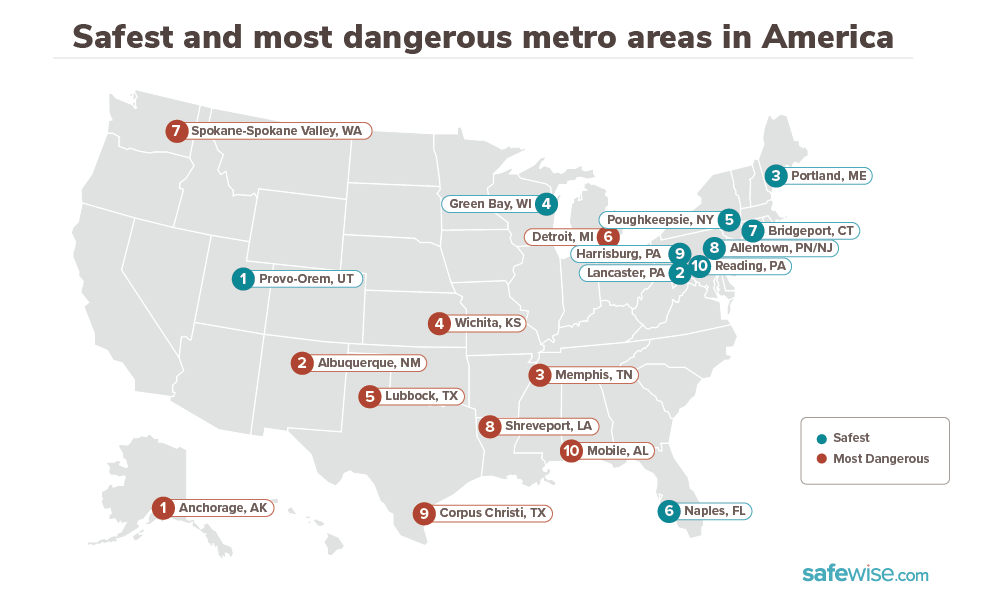

10 Most Dangerous Cities in America for 2020

Everyone wants to feel safe at home, but what if your city reports more crimes than other cities?

Does that mean your town or neighborhood is dangerous?

This is a complicated subject, and it’s one we’ve tried to examine for years. Today’s high current of civil unrest makes these questions more vital than ever. As part of our commitment to provide the most helpful and relevant information in our reports, we’ve made some changes this year.

You’ll find a deeper analysis of multiple factors that impact life in the metro communities that report the highest numbers of crime incidents.

For the purposes of this report, the terms “dangerous” and “safest” refer explicitly to crime rates as calculated from FBI crime data—no other characterization of any community is implied or intended.

Here are the 10 most dangerous metro areas in America for 2020
Anchorage, Alaska
Albuquerque, New Mexico
Memphis, Tennessee
Wichita, Kansas
Lubbock, Texas
Detroit-Dearborn-Livonia, Michigan
Spokane-Spokane Valley, Washington
Shreveport-Bossier City, Louisiana
Corpus Christi, Texas
Mobile, Alabama
Find out the statistics for every metro area that made our list.

Crime rates
Income and education data
City resources
What these rankings mean
To determine the rankings for the most “dangerous” metro cities in America, we started with the most current FBI crime reports. This data isn’t flawless—it’s self reported by law enforcement agencies—but it’s the most extensive crime data available.

We calculated both violent and property crime rates per 1,000 residents in each metro area. Both rates were used to rank the cities. Metro areas with the highest collective violent and property crime rates landed at the bottom of the overall list, making them part of our most “dangerous” rankings. Cities with the lowest crime rates rose to the top and made it onto our “safest” metro cities list.

Read our complete safest cities reporting methodology.

A snapshot of the most dangerous metro cities in America
Crime statistics are just one piece of the puzzle when it comes to considering how “safe” or “dangerous” a community is.To add more depth to our examination of each metro area that ranked in the top 10 for high crime rates, we researched several additional factors:

Median income and poverty data¹
High school graduation rates¹
Redlining practices²
Household access to high-speed internet³
City budget allocations⁴
Unemployment rates⁵
We chose these data points because we’ve noticed a correlation between socioeconomic factors and reported crime rates. To see if our observations have been on the mark, we dove into metrics that help paint a picture of the general socioeconomic climate of each metro area we ranked.

In addition to crime statistics, we looked at things like household income, access to resources like internet service, and city budget allocations.
This supplemental data wasn’t used for ranking purposes. We used it to help provide a more holistic view of the metro areas that landed on our listings.

And even though added context doesn’t tell us everything about these cities, it offers a starting point to help us compare and contrast trends in communities that consistently report low or high crime numbers.
